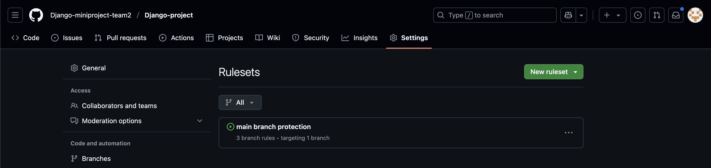
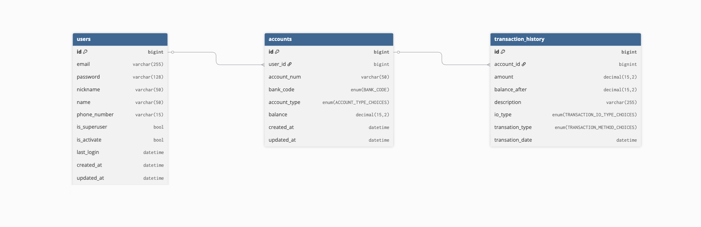
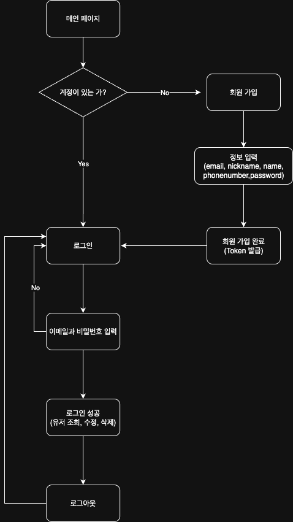

# // 📑 Django Mini Project // 🏦 가계부 시스템 구현하기 //

---

### -- 프로젝트 목표 --

- 사용자는 계좌를 등록, 삭제, 조회 등을 할 수 있고, 입출금 기록을 기록, 조회, 삭제, 수정을 할 수 있다.
- 마지막으론 AWS EC2 배포까지 진행한다.

---

⭐️ 주요 기능
* 회원가입
* 로그인, 로그아웃
* Django Admin Page
* 계좌 CRD
* 거래내역 CRD
* 거래내역 필터링

---

## 🪜 Step 1.

### - 개발 환경 및 협업 환경 준비와 프로젝트 구조와 규칙 설정, CI 구성 - 

---
#### 1. 팀 레포지토리 생성 및 규칙 생성

- 팀 레포지토리 생성 후 1명 이상의 승인이 있어야 merge할 수 있게 설정



#### 2. Django Project 생성

* uv를 활용하여 Django-project 세팅
* uv add를 통해 필요한 라이브러리들 설치
(django, django-restframework, --dev, drf-yasg)
* config/settings.py를 개발 환경과 배포 환경 두 개의 파일로 분리
```
Django-project/
├── .venv/   
├── config/
│   ├── __init__.py
│   ├── settings        
│   │   ├── __init__.py          
│   │   ├── base.py               # 공통 설정
│   │   ├── dev.py                # 개발 환경 설정
│   │   └── prod.py               # 배포 환경 설정
│   ├── urls.py                 
│   └── wsgi.py
├── manage.py
├── pyproject.toml
├── uv.lock                     # uv로 생성된 가상환경
└── apps/
    └── ...                       # 각 앱 디렉토리
```
3. Postgres DB 연결
* uv add postgres로 설치
* DB 생성 후 `config/settings/dev.py`에 추가
```
# DB 정보는 .env에 추가
import os 

DATABASES = {
    "default": {
        "ENGINE": "django.db.backends.postgresql",
        "NAME": os.getenv("DB_NAME"),
        "USER": os.getenv("DB_USER"),
        "PASSWORD": os.getenv("DB_PASSWORD"),
        "HOST": os.getenv("DB_HOST", "localhost"),
        "PORT": os.getenv("DB_PORT", "5432"),
    }
}
```
4. Github Actions CI 구성
* black, isort 코드 포매터 설치
* Database 연결정보를 Github Repository의 Settings → Secrets and Variables → Action → New repository secret에 추가하여 민감 정보 노출X
* 프로젝트 루트 디렉터리에 `.github` 폴더 생성, 하위에 `workflows/checks.yml` 생성
```
# .github/workflows/checks.yml

name: Checks

on:
  push:
    branches:
      - '**' # 모든 브랜치
  pull_request:
    branches:
      - '**'

jobs:
  test:
    runs-on: ubuntu-latest
    env: 
      DJANGO_SECRET_KEY: super-secret-key-for-ci
      DB_USER: ${{ secrets.DB_USER }}
      DB_PASSWORD: ${{ secrets.DB_PASSWORD }}
      DB_NAME: ${{  secrets.DB_NAME  }}
    services:
      db:
        image: postgres:14
        ports:
          - 5432:5432
        env:
          POSTGRES_USER: ${{ secrets.DB_USER }}
          POSTGRES_PASSWORD: ${{ secrets.DB_PASSWORD }}
          POSTGRES_DB: ${{ secrets.DB_NAME }}
        options: >-
          --health-cmd pg_isready
          --health-interval 10s
          --health-timeout 5s
          --health-retries 5

    steps:
    - name: Checkout code
      uses: actions/checkout@v3

    - name: Set up Python
      uses: actions/setup-python@v4
      with:
        python-version: '3.12'

    - name: Install uv
      run: |
        curl -LsSf https://astral.sh/uv/install.sh | sh
        echo "$HOME/.local/bin" >> $GITHUB_PATH
        echo "$HOME/.cargo/bin" >> $GITHUB_PATH

    - name: Install Packages & Libraries
      run: |
        uv sync --dev

    - name: Run isort (Import sorting)
      run: |
        uv run isort . --check --diff

    - name: Run black (Code formatting)
      run: |
        uv run black . --check

    - name: Wait for PostgreSQL
      run: |
        until pg_isready -h localhost -p ${{ secrets.DB_PORT }} -U ${{ secrets.DB_USER }}; do
          sleep 1
        done

    - name: Run Django Migration
      run: |
        uv run python manage.py makemigrations
        uv run python manage.py migrate
```
---
# 🪜 Step 2.

### - ERD를 구성하고 Django ORM을 활용한 Model 생성 -

---
1. ERD 작성
* 각 테이블과 테이블 간의 관계를 파악하여 데이터베이스 구조를 명확히 함



---

2. Models 생성

* Users Model 
```
# apps/users/models.py

from django.contrib.auth.models import (
    AbstractBaseUser,
    BaseUserManager,
    PermissionsMixin,
)
from django.db import models
from django.utils import timezone


# 유저 관리자 생성 클래스
class CustomUserManager(BaseUserManager):
    # 일반 유저 생성 시
    def create_user(self, email, password=None, **extra_fields):
        if not email:
            raise ValueError("이메일 주소를 입력해주세요.")
        email = self.normalize_email(email)  # 이메일 표준화
        user = self.model(email=email, **extra_fields)
        user.set_password(password)  # 비밀번호 해싱
        user.save(using=self._db)  # 현재 사용중인 DB에 저장
        return user

    # 관리자 생성 시
    def create_superuser(self, email, password=None, **extra_fields):
        extra_fields.setdefault("is_staff", True)
        extra_fields.setdefault("is_superuser", True)
        extra_fields.setdefault("is_active", True)

        if extra_fields.get("is_staff") is not True:
            raise ValueError("superuser는 is_staff=True 이어야 합니다.")
        if extra_fields.get("is_superuser") is not True:
            raise ValueError("superuser는 is_superuser=True 이어야 합니다.")

        # 검증 끝낸 후 유저 인스턴스 생성
        return self.create_user(email, password, **extra_fields)


# 유저 생성 클래스
class User(AbstractBaseUser, PermissionsMixin):
    email = models.EmailField(
        verbose_name="이메일 주소",  # 한국어 UI 제공
        max_length=255,
        unique=True,
    )
    nickname = models.CharField(
        max_length=50,
        verbose_name="별명",
        unique=True,
    )
    name = models.CharField(max_length=50, verbose_name="성함")
    phone_number = models.CharField(max_length=15, verbose_name="전화번호")
    last_login = models.DateTimeField(default=timezone.now)
    is_staff = models.BooleanField(default=False)
    is_superuser = models.BooleanField(default=False)
    is_active = models.BooleanField(default=True)

    # 생성일 - auto_now_add : 처음 생성될 때 현재 시간
    created_at = models.DateTimeField(auto_now_add=True)
    # 변경일 - auto_now : 저장될 때마다 현재 시간
    updated_at = models.DateTimeField(auto_now=True)

    objects = CustomUserManager()

    # 사용자 식별자로 사용할 필드 지정
    USERNAME_FIELD = "email"
    # superuser 생성 시 필수 요구 사항
    REQUIRED_FIELDS = ["nickname", "name", "phone_number"]

    # 사용자 인스턴스를 문자열로 표현할 때 이메일로 반환
    def __str__(self):
        return self.email

    # 한국어 UI -> 가독성 향상
    class Meta:
        verbose_name = "사용자"
        verbose_name_plural = "사용자들"
```

* Accounts Model
```
# apps/accounts/models.py

from django.db import models

from apps.common.models import BaseModel
from apps.users.models import User

BANK_CODES = [
    ("000", "알수없음"),
    ("001", "한국은행"),
    ("002", "산업은행"),
    ("003", "기업은행"),
    ("004", "국민은행"),
    ("005", "외환은행"),
    ("007", "수협중앙회"),
    ("008", "수출입은행"),
    ("011", "농협은행"),
    ("012", "지역농.축협"),
    ("020", "우리은행"),
    ("023", "SC은행"),
    ("027", "한국씨티은행"),
    ("031", "대구은행"),
    ("032", "부산은행"),
    ("034", "광주은행"),
    ("035", "제주은행"),
    ("037", "전북은행"),
    ("039", "경남은행"),
    ("045", "새마을금고중앙회"),
    ("048", "신협중앙회"),
    ("050", "상호저축은행"),
    ("051", "중국은행"),
    ("052", "모건스탠리은행"),
    ("054", "HSBC은행"),
    ("055", "도이치은행"),
    ("056", "알비에스피엘씨은행"),
    ("057", "제이피모간체이스은행"),
    ("058", "미즈호은행"),
    ("059", "미쓰비시도쿄UFJ은행"),
    ("060", "BOA은행"),
    ("061", "비엔피파리바은행"),
    ("062", "중국공상은행"),
    ("063", "중국은행"),
    ("064", "산림조합중앙회"),
    ("065", "대화은행"),
    ("066", "교통은행"),
    ("071", "우체국"),
    ("076", "신용보증기금"),
    ("077", "기술보증기금"),
    ("081", "KEB하나은행"),
    ("088", "신한은행"),
    ("089", "케이뱅크"),
    ("090", "카카오뱅크"),
    ("092", "토스뱅크"),
    ("093", "한국주택금융공사"),
    ("094", "서울보증보험"),
    ("095", "경찰청"),
    ("096", "한국전자금융(주)"),
    ("099", "금융결제원"),
    ("102", "대신저축은행"),
    ("103", "에스비아이저축은행"),
    ("104", "에이치케이저축은행"),
    ("105", "웰컴저축은행"),
    ("106", "신한저축은행"),
    ("209", "유안타증권"),
    ("218", "현대증권"),
    ("221", "골든브릿지투자증권"),
    ("222", "한양증권"),
    ("223", "리딩투자증권"),
    ("224", "BNK투자증권"),
    ("225", "IBK투자증권"),
    ("226", "KB투자증권"),
    ("227", "KTB투자증권"),
    ("230", "미래에셋증권"),
    ("238", "대우증권"),
    ("240", "삼성증권"),
    ("243", "한국투자증권"),
    ("261", "교보증권"),
    ("262", "하이투자증권"),
    ("263", "HMC투자증권"),
    ("264", "키움증권"),
    ("265", "이베스트투자증권"),
    ("266", "SK증권"),
    ("267", "대신증권"),
    ("269", "한화투자증권"),
    ("270", "하나대투증권"),
    ("278", "신한금융투자"),
    ("279", "DB금융투자"),
    ("280", "유진투자증권"),
    ("287", "메리츠종합금융증권"),
    ("289", "NH투자증권"),
    ("290", "부국증권"),
    ("291", "신영증권"),
    ("292", "엘아이지투자증권"),
    ("293", "한국증권금융"),
    ("294", "펀드온라인코리아"),
    ("295", "우리종합금융"),
    ("296", "삼성선물"),
    ("297", "외환선물"),
    ("298", "현대선물"),
]

ACCOUNT_TYPE_CHOICES = [
    ("CHECKING", "입출금"),
    ("SAVING", "적금"),
    ("LOAN", "대출"),
    ("PENSION", "연금"),
    ("TRUST", "신탁"),
    ("FOREIGN_CURRENCY", "외화"),
    ("IRP", "퇴직연금"),
    ("STOCK", "주식"),
]


class Account(BaseModel):
    # 유저 정보
    user = models.ForeignKey(
        User,
        on_delete=models.CASCADE,  # 종속 삭제 옵션. 이 계좌가 참조하는 User가 삭제될 경우, 이 Account 데이터도 함께 자동으로 삭제됨.
        related_name="accounts",  # 역참조 시 사용할 이름. user 객체에서 이 사용자가 소유한 모든 계좌에 접근하고 싶을 때, user.accounts.all()과 같은 직관적인 코드를 사용할 수 있게 해줌.
        verbose_name="사용자",
    )
    # 계좌 번호
    account_number = models.CharField(
        max_length=50, unique=True, verbose_name="계좌번호"
    )
    # 은행 코드
    bank_code = models.CharField(
        max_length=10, choices=BANK_CODES, verbose_name="은행 코드"
    )
    # 계좌 종류
    account_type = models.CharField(
        max_length=20, choices=ACCOUNT_TYPE_CHOICES, verbose_name="계좌 종류"
    )
    # 잔액 (소수점 포함 가능성 있기에 DecimalField 사용)
    balance = models.DecimalField(
        max_digits=15, decimal_places=2, default=0.00, verbose_name="잔액"
    )

    class Meta:
        verbose_name = "계좌"
        verbose_name_plural = "계좌 목록"
        unique_together = ("user", "account_number")

    def __str__(self):
        # 이 Account 객체를 사람이 알아보기 쉬운 문자열로 표현
        # Django 관리자 페이지나 디버깅 시, Account object(2)와 같이 알아보기 힘든 표현 대신
        # '홍길동의 국민은행 계좌 (123-456)'와 같이 훨씬 명확한 형태로 객체를 표시한다.
        return f"{self.user.nickname}의 {self.get_bank_code_display()} 계좌 ({self.account_number})"
```

* Transactions Model
```
# apps/transactions/modesl.py

from django.db import models

from apps.accounts.models import Account

# 거래 종류
TRANSACTION_TYPE_CHOICES = [
    ("ATM", "ATM 거래"),
    ("TRANSFER", "계좌이체"),
    ("AUTOMATIC_TRANSFER", "자동이체"),
    ("CARD", "카드결제"),
    ("INTEREST", "이자"),
]
# 거래 타입
DEPOSIT_WITHDRAWAL_CHOICES = [
    ("DEPOSIT", "입금"),
    ("WITHDRAW", "출금"),
]


class Transaction(models.Model):
    account = models.ForeignKey(
        Account,
        on_delete=models.CASCADE,
        related_name="transactions",
        verbose_name="계좌 정보",
    )
    amount = models.DecimalField(
        max_digits=15, decimal_places=2, verbose_name="거래 금액"
    )
    balance_after = models.DecimalField(
        max_digits=15, decimal_places=2, verbose_name="거래 후 잔액"
    )
    description = models.CharField(max_length=255, blank=True, help_text="거래 내역")

    transaction_type = models.CharField(
        max_length=20, choices=TRANSACTION_TYPE_CHOICES, help_text="거래 타입"
    )

    io_type = models.CharField(
        max_length=10, choices=DEPOSIT_WITHDRAWAL_CHOICES, help_text="입출금 타입"
    )

    transaction_date = models.DateTimeField(
        verbose_name="거래 일시",
        auto_now_add=True,
    )
    transaction_updated = models.DateTimeField(
        auto_now=True,
        verbose_name="거래 내역 수정 일시",
    )

    def __str__(self):
        return f"[{self.account.account_number}] {self.get_io_type_display()} {self.amount} - {self.description}"

    class Meta:
        verbose_name = "거래 내역"
        verbose_name_plural = "거래 내역들"
```
---
# 🪜 Step 3.
### - Users, Accounts, Transactions API 생성과 Test Code를 작성 -

--- 

1. 회원가입, 로그인, 로그아웃, 토큰 재발급 기능 구현
* 웹 사이트 프로젝트의 기초가 되는 핵심 기능들
* 사용자는 계정을 생성, 관리가 가능하게 함
  
(1) 회원가입, 로그인, 로그아웃의 로직을 설계해 플로우 차트 제작


(2) 회원가입, 로그인, 로그아웃, 정보 확인 및 수정, 삭제 기능 구성
``` 
# apps/users/views.py

from django.conf import settings
from django.shortcuts import get_object_or_404
from drf_spectacular.utils import extend_schema
from rest_framework import status
from rest_framework.permissions import AllowAny
from rest_framework.views import APIView, Response
from rest_framework_simplejwt.exceptions import TokenError
from rest_framework_simplejwt.tokens import RefreshToken

from .models import User
from .permissions import IsOwner
from .serializers import LoginSerializer, UserRegisterSerializer, UserSerializer


# 회원가입 API
class UserRegisterView(APIView):
    authentication_classes = ()
    permission_classes = (AllowAny,)

    # drf-spectacular 데코레이터: OpenAPI 자동 생성
    @extend_schema(
        summary="새로운 계정 생성",
        description="이메일, 닉네임, 이름, 비밀번호, 전화번호를 입력하여 새로운 계정을 생성합니다. ",
        request=UserRegisterSerializer,
        responses={
            201: {
                "description": "회원가입 성공",
                "content": {
                    "application/json": {
                        "schema": {
                            "type": "object",
                            "properties": {
                                "message": {
                                    "type": "string",
                                    "example": "회원가입이 성공적으로 완료되었습니다.",
                                }
                            },
                        },
                    },
                },
            },
            400: UserRegisterSerializer,  # 유효성 검사 실패 시 에러 반환
        },
    )
    def post(self, request):
        serializer = UserRegisterSerializer(data=request.data)
        if serializer.is_valid():  # 유효성 검사
            serializer.save()
            return Response(
                {"message": "회원가입이 성공적으로 완료되었습니다"},
                status=status.HTTP_201_CREATED,
            )
        return Response(serializer.errors, status=status.HTTP_400_BAD_REQUEST)


# 로그인 API
class JWTLoginView(APIView):
    authentication_classes = ()
    permission_classes = (AllowAny,)

    @extend_schema(
        request=LoginSerializer,
        responses={
            200: {"message": "로그인이 성공적으로 완료되었습니다."},
            400: LoginSerializer,
        },
    )
    def post(self, request):
        serializer = LoginSerializer(data=request.data, context={"request": request})
        serializer.is_valid(
            raise_exception=True
        )  # 유효성 검사 실패 시 자동으로 400 응답

        # validate 메서드에서 설정한 user 가져오기
        user = serializer.validated_data["user"]

        refresh = RefreshToken.for_user(user)
        access_token = str(refresh.access_token)

        user_serializer = UserSerializer(user)

        response = Response(
            {"access": access_token, "user": user_serializer.data},
            status=status.HTTP_200_OK,
        )
        response.set_cookie(
            "refresh_token",
            value=str(refresh),
            httponly=True,
            secure=settings.REFRESH_TOKEN_COOKIE_SECURE,
            samesite="Lax",
            max_age=5 * 60 * 60,
        )
        return response


# 로그아웃 API
class JWTLogoutView(APIView):

    @extend_schema(
        responses={
            205: {"message": "성공적으로 로그아웃되었습니다."},
            500: {"message": "서버에 문제가 있습니다."},
        }
    )
    def post(self, request):
        try:
            refresh_token = request.COOKIES.get("refresh_token")

            if not refresh_token:
                return Response(
                    {"error": "Refresh token이 제공되지 않았습니다."},
                    status=status.HTTP_400_BAD_REQUEST,
                )

            token = RefreshToken(refresh_token)
            token.blacklist()

            response = Response(
                {"message": "성공적으로 로그아웃되었습니다."},
                status=status.HTTP_205_RESET_CONTENT,
            )

            # 로그인시 설정했던 쿠키와 동일하게 해야 함
            response.set_cookie(
                "refresh_token",
                value="",  # 값을 비워줌
                httponly=True,
                secure=settings.REFRESH_TOKEN_COOKIE_SECURE,
                samesite="Lax",
                max_age=0,  # 0초 -> 즉시 만료
                expires="Thu, 01 Jan 1970 00:00:00 GMT",
            )
            return response

        except TokenError:
            return Response(
                {"error": "유효하지 않거나 만료된 토큰입니다."},
                status=status.HTTP_400_BAD_REQUEST,
            )
        except Exception as e:
            return Response(
                {"error": f"로그아웃 중 오류가 발생했습니다: {str(e)}"},
                status=status.HTTP_500_INTERNAL_SERVER_ERROR,
            )

    # 유저 프로필 조회, 수정, 삭제 API


class UserProfileAPIView(APIView):
    # View 권한 검사
    permission_classes = (IsOwner,)

    @extend_schema(
        responses={
            200: {"message": "프로필이 조회되었습니다."},
            500: {"message": "서버에 문제가 있습니다."},
        }
    )
    # 특정 유저 조회
    def get(self, request, pk):

        user_to_retrieve = get_object_or_404(User, pk=pk)

        self.check_object_permissions(request, user_to_retrieve)

        serializer = UserSerializer(user_to_retrieve)
        return Response(serializer.data, status=status.HTTP_200_OK)

    @extend_schema(
        request=UserSerializer,
        responses={
            200: {"message": "프로필이 성공적으로 수정되었습니다."},
            400: UserSerializer,
        },
    )
    # 특정 유저 업데이트
    def patch(self, request, pk):

        user_to_update = get_object_or_404(User, pk=pk)

        self.check_object_permissions(request, user_to_update)

        # partial=True는 PATCH 요청에 필수, 일부 필드만 검증
        serializer = UserSerializer(user_to_update, data=request.data, partial=True)
        serializer.is_valid(raise_exception=True)
        serializer.save()
        return Response(serializer.data, status=status.HTTP_200_OK)

    @extend_schema(responses={204: None, 500: {"message": "서버에 문제가 있습니다."}})
    # 특정 유저 삭제
    def delete(self, request, pk):
        user_to_delete = get_object_or_404(User, pk=pk)

        self.check_object_permissions(request, user_to_delete)

        user_to_delete.delete()
        return Response(
            {"message": "Deleted successfully"}, status=status.HTTP_204_NO_CONTENT
        )
```

2. Django Admin Page 구성
```
# apps/users/admin.py

from django.contrib import admin

from .models import *


@admin.register(User)
class UserAdmin(admin.ModelAdmin):
    list_display = (
        "email",
        "nickname",
        "name",
        "phone_number",
        "is_active",
        "is_staff",
        "is_superuser",
    )
    search_fields = ["email", "nickname", "phone_number"]
    list_filter = ("is_active", "is_staff")

    def get_form(self, request, obj=None, **kwargs):
        form = super().get_form(request, obj, **kwargs)

        if not request.user.is_superuser:
            form.base_fields["is_superuser"].disabled = True
        return form
```

3. 계좌 생성, 조회, 삭제 기능 구성
``` 
# apps/accounts/views.py

from rest_framework import status
from rest_framework.permissions import IsAuthenticated
from rest_framework.response import Response
from rest_framework.views import APIView

from .models import Account
from .serializers import AccountSerializer


class AccountListCreateView(APIView):
    """
    계좌 목록 조회 및 신규 계좌 생성
    """

    permission_classes = [IsAuthenticated]

    def get(self, request):
        """사용자의 계좌 목록을 조회합니다."""
        accounts = Account.objects.filter(user=request.user)
        serializer = AccountSerializer(accounts, many=True)
        return Response(serializer.data)

    def post(self, request):
        """신규 계좌를 생성합니다."""
        serializer = AccountSerializer(data=request.data)
        if serializer.is_valid(raise_exception=True):
            serializer.save(user=request.user)  # 현재 로그인된 사용자를 user로 설정
            return Response(serializer.data, status=status.HTTP_201_CREATED)


class AccountDetailView(APIView):
    """
    특정 계좌의 상세 조회, 수정, 삭제
    """

    permission_classes = [IsAuthenticated]

    def get_object(self, pk, user):
        try:
            return Account.objects.get(pk=pk, user=user)
        except Account.DoesNotExist:
            return None

    def get(self, request, pk):
        """특정 계좌 정보를 조회합니다."""
        account = self.get_object(pk, request.user)
        if account is None:
            return Response(
                {"error": "계좌를 찾을 수 없거나 권한이 없습니다."},
                status=status.HTTP_404_NOT_FOUND,
            )
        serializer = AccountSerializer(account)
        return Response(serializer.data)

    def delete(self, request, pk):
        """특정 계좌를 삭제합니다."""
        account = self.get_object(pk, request.user)
        if account is None:
            return Response(
                {"error": "계좌를 찾을 수 없거나 권한이 없습니다."},
                status=status.HTTP_404_NOT_FOUND,
            )
        account.delete()
        return Response(status=status.HTTP_204_NO_CONTENT)
```

4. 입출금 기록, 조회, 삭제, 수정 기능 구성
```
# apps/transactions/views.py

from decimal import Decimal

from django.db import transaction
from django.shortcuts import get_object_or_404
from drf_spectacular.utils import extend_schema
from rest_framework import status
from rest_framework.response import Response
from rest_framework.views import APIView

from apps.accounts.models import Account
from apps.transactions.models import Transaction
from apps.transactions.serializers import (
    TransactionHistorySerializer,
    TransactionsCreateSerializer,
    TransactionsUpdateSerializer,
)


class TransactionView(APIView):
    @extend_schema(
        summary="현재 로그인된 사용자의 모든 계좌 거래 내역 조회",
        description="인증된 사용자가 소유한 모든 계좌의 거래 내역을 최근 거래일 기준으로 내림차순으로 조회합니다.",
        responses={
            200: TransactionHistorySerializer(many=True),
            401: {"description": "인증 정보 없음 (Unauthorized)"},
            404: {"description": "사용자 계좌를 찾을 수 없음"},
        },
        tags=["transaction"],
    )
    # 현재 로그인 된 사용자 거래 내역 조회
    def get(self, request):
        # 사용자와 연결된 계좌 가져오기
        accounts = Account.objects.filter(user=request.user)
        if not accounts.exists():
            return Response(
                {"error": "사용자 계좌를 찾을 수 없습니다."},
                status=status.HTTP_404_NOT_FOUND,
            )

        # 해당 계좌의 모든 거래 내역 조회 - 최근 거래 시간 순으로 정렬
        # account__in 은 account 필드 값이 특정 집합에 포함되는지 확인
        transactions = Transaction.objects.filter(account__in=accounts).order_by(
            "-transaction_date"
        )  # 내림차순
        serializer = TransactionHistorySerializer(
            transactions, many=True
        )  # 거래 내역 직렬화
        return Response(serializer.data, status=status.HTTP_200_OK)


class TransactionCreateView(APIView):
    @extend_schema(
        summary="새로운 거래 내역 생성 및 계좌 잔액 업데이트",
        description="입금 또는 출금 거래 내역을 생성하고, 해당 계좌의 잔액을 업데이트합니다.",
        request=TransactionsCreateSerializer,
        responses={
            201: TransactionsCreateSerializer,
            400: {"description": "잘못된 요청 데이터 (Bad Request)"},
            401: {"description": "인증 정보 없음 (Unauthorized)"},
            403: {"description": "접근 권한 없음 (Forbidden)"},
        },
        tags=["transaction"],
    )
    # 거래 내역 생성
    def post(self, request):
        account_id = request.data.get("account")
        io_type = request.data.get("io_type")
        transaction_type = request.data.get("transaction_type")
        transaction_amount = request.data.get("amount")

        if not account_id:
            return Response(
                {"error": "계좌 ID가 필요합니다."}, status=status.HTTP_400_BAD_REQUEST
            )
        if transaction_amount is None:
            return Response(
                {"error": "거래 금액이 필요합니다."}, status=status.HTTP_400_BAD_REQUEST
            )
        if io_type not in ["DEPOSIT", "WITHDRAW"]:
            return Response(
                {"error": "올바른 거래 유형(DEPOSIT 또는 WITHDRAW)을 입력하세요."},
                status=status.HTTP_400_BAD_REQUEST,
            )
        if transaction_type not in [
            "ATM",
            "TRANSFER",
            "AUTOMATIC_TRANSFER",
            "CARD",
            "INTEREST",
        ]:
            return Response({"error": "올바른 거래 종류를 입력해주세요"})

        # 사용자의 계좌가 맞는지 확인
        try:
            account = Account.objects.get(id=account_id, user=request.user)
        except Account.DoesNotExist:
            # 해당 ID의 계좌가 없거나 사용자의 소유가 아닐 경우
            return Response(
                {"error": "유효하지 않은 계좌 ID이거나, 접근 권한이 없습니다."},
                status=status.HTTP_403_FORBIDDEN,
            )

        # Django의 Atomic Transaction을 사용하여 잔액 업데이트와 거래 내역 생성을 원자적으로 처리
        with transaction.atomic():
            current_balance = account.balance
            new_balance = current_balance

            try:
                transaction_amount = Decimal(str(transaction_amount))
            except (ValueError, TypeError):
                return Response(
                    {"error": "잘못된 거래 금액 형식입니다."},
                    status=status.HTTP_400_BAD_REQUEST,
                )

            if io_type == "DEPOSIT":
                new_balance = current_balance + transaction_amount
            elif io_type == "WITHDRAW":
                if transaction_amount > current_balance:
                    return Response(
                        {"error": "잔액이 부족합니다."},
                        status=status.HTTP_400_BAD_REQUEST,
                    )
                new_balance = current_balance - transaction_amount

            # 시리얼라이저를 통한 거래 내역 생성
            # post_transaction_amount는 뷰에서 계산하여 전달
            serializer = TransactionsCreateSerializer(data=request.data)
            if serializer.is_valid():
                # 유효한 데이터라면 저장
                serializer.save(account=account, balance_after=new_balance)

                # 계좌 잔액 업데이트
                account.balance = new_balance
                account.save()

                return Response(serializer.data, status=status.HTTP_201_CREATED)
            else:
                return Response(serializer.errors, status=status.HTTP_400_BAD_REQUEST)


class TransactionHistoryDetailView(APIView):
    @extend_schema(
        summary="특정 거래 내역 수정",
        description="지정된 ID의 거래 내역을 수정합니다. 부분 업데이트가 가능하며, 해당 거래가 로그인된 사용자의 계좌와 연결되어 있어야 합니다.",
        request=TransactionsUpdateSerializer(partial=True),  # partial=True 명시
        responses={
            200: TransactionsUpdateSerializer,
            400: {"description": "잘못된 요청 데이터 (Bad Request)"},
            401: {"description": "인증 정보 없음 (Unauthorized)"},
            404: {"description": "거래 내역을 찾을 수 없음"},
        },
        tags=["transaction"],
    )
    # 특정 거래 내역 수정
    def put(self, request, pk):
        # 거래 내역 ID로 특정 거래 내역 조회 (로그인된 사용자의 계좌와 연결된 거래만 허용)
        transaction_obj = get_object_or_404(
            Transaction, pk=pk, account__user=request.user
        )
        # account__user 는 관계 모델의 특정 필드를 지정해서 필터링하거나 값을 가져올 때 사용
        # transaction -FK> account -FK> user

        # 데이터 업데이트
        serializer = TransactionsUpdateSerializer(
            transaction_obj, data=request.data, partial=True
        )
        # partial=True 는 부분 업데이트를 허용하여 요청 데이터에 포함된 필드만 업데이트 하고, 나머지는 기존값을 유지
        # partial 옵션을 설정하지 않으면 기본값인 False 가 되어 모든 필드가 포함 되어야 유효성 검증을 통과

        if serializer.is_valid():
            serializer.save()
            return Response(serializer.data, status=status.HTTP_200_OK)
        return Response(serializer.errors, status=status.HTTP_400_BAD_REQUEST)

    @extend_schema(
        summary="특정 거래 내역 삭제",
        description="지정된 ID의 거래 내역을 삭제합니다. 해당 거래가 로그인된 사용자의 계좌와 연결되어 있어야 합니다.",
        responses={
            200: {"description": "성공적으로 삭제됨"},
            401: {"description": "인증 정보 없음 (Unauthorized)"},
            404: {"description": "거래 내역을 찾을 수 없음"},
        },
        tags=["transaction"],
    )
    # 특정 거래 내역 삭제
    def delete(self, request, pk):
        transaction_obj = get_object_or_404(
            Transaction, pk=pk, account__user=request.user
        )
        transaction_obj.delete()
        return Response(
            {"message": "거래 내역이 성공적으로 삭제되었습니다."},
            status=status.HTTP_200_OK,
        )
```
5. Accounts Model과 Transactions Model TestCode 작성

`apps/accounts/tests.py`
```
from django.urls import reverse
from rest_framework import status
from rest_framework.test import APITestCase

from apps.accounts.models import Account
from apps.users.models import User


class AccountAPITestCase(APITestCase):
    def setUp(self):
        self.user = User.objects.create_user(
            email="testuser@example.com",
            password="testpassword123",
            nickname="testuser",
            name="Test User",
            phone_number="01012345678",
        )
        self.client.force_authenticate(user=self.user)
        self.account_list_create_url = reverse("account-list-create")
        self.account_detail_url = lambda pk: reverse(
            "account-detail", kwargs={"pk": pk}
        )

    def test_create_account(self):
        """
        새로운 계좌를 생성하는 테스트
        """
        data = {
            "account_number": "1234567890",
            "bank_code": "004",  # 국민은행
            "account_type": "CHECKING",
        }
        response = self.client.post(self.account_list_create_url, data, format="json")
        self.assertEqual(response.status_code, status.HTTP_201_CREATED)
        self.assertEqual(Account.objects.count(), 1)
        self.assertEqual(Account.objects.get().account_number, "1234567890")
        self.assertEqual(Account.objects.get().user, self.user)

    def test_create_account_without_authentication(self):
        """
        인증 없이 계좌 생성 시도 시 실패하는 테스트
        """
        self.client.force_authenticate(user=None)
        data = {
            "account_number": "1234567890",
            "bank_code": "004",
            "account_type": "CHECKING",
        }
        response = self.client.post(self.account_list_create_url, data, format="json")
        self.assertEqual(response.status_code, status.HTTP_401_UNAUTHORIZED)

    def test_list_accounts(self):
        """
        계좌 목록을 조회하는 테스트
        """
        Account.objects.create(
            user=self.user,
            account_number="1111111111",
            bank_code="004",
            account_type="CHECKING",
            balance=1000.00,
        )
        Account.objects.create(
            user=self.user,
            account_number="2222222222",
            bank_code="088",  # 신한은행
            account_type="SAVING",
            balance=2000.00,
        )
        response = self.client.get(self.account_list_create_url, format="json")
        self.assertEqual(response.status_code, status.HTTP_200_OK)
        self.assertEqual(len(response.data), 2)
        self.assertEqual(response.data[0]["account_number"], "1111111111")
        self.assertEqual(response.data[1]["account_number"], "2222222222")

    def test_retrieve_account(self):
        """
        특정 계좌를 상세 조회하는 테스트
        """
        account = Account.objects.create(
            user=self.user,
            account_number="1111111111",
            bank_code="004",
            account_type="CHECKING",
            balance=1000.00,
        )
        response = self.client.get(self.account_detail_url(account.pk), format="json")
        self.assertEqual(response.status_code, status.HTTP_200_OK)
        self.assertEqual(response.data["account_number"], "1111111111")

    def test_retrieve_non_existent_account(self):
        """
        존재하지 않는 계좌를 조회 시도 시 실패하는 테스트
        """
        response = self.client.get(self.account_detail_url(999), format="json")
        self.assertEqual(response.status_code, status.HTTP_404_NOT_FOUND)

    def test_retrieve_other_user_account(self):
        """
        다른 사용자의 계좌를 조회 시도 시 실패하는 테스트
        """
        other_user = User.objects.create_user(
            email="otheruser@example.com",
            password="otherpassword123",
            nickname="otheruser",
            name="Other User",
            phone_number="01098765432",
        )
        other_account = Account.objects.create(
            user=other_user,
            account_number="3333333333",
            bank_code="004",
            account_type="CHECKING",
            balance=500.00,
        )
        response = self.client.get(
            self.account_detail_url(other_account.pk), format="json"
        )
        self.assertEqual(
            response.status_code, status.HTTP_404_NOT_FOUND
        )  # 권한이 없으므로 404 반환

    def test_delete_account(self):
        """
        계좌를 삭제하는 테스트
        """
        account = Account.objects.create(
            user=self.user,
            account_number="1111111111",
            bank_code="004",
            account_type="CHECKING",
            balance=1000.00,
        )
        response = self.client.delete(
            self.account_detail_url(account.pk), format="json"
        )
        self.assertEqual(response.status_code, status.HTTP_204_NO_CONTENT)
        self.assertEqual(Account.objects.count(), 0)

    def test_delete_non_existent_account(self):
        """
        존재하지 않는 계좌를 삭제 시도 시 실패하는 테스트
        """
        response = self.client.delete(self.account_detail_url(999), format="json")
        self.assertEqual(response.status_code, status.HTTP_404_NOT_FOUND)

    def test_delete_other_user_account(self):
        """
        다른 사용자의 계좌를 삭제 시도 시 실패하는 테스트
        """
        other_user = User.objects.create_user(
            email="otheruser@example.com",
            password="otherpassword123",
            nickname="otheruser",
            name="Other User",
            phone_number="01098765432",
        )
        other_account = Account.objects.create(
            user=other_user,
            account_number="3333333333",
            bank_code="004",
            account_type="CHECKING",
            balance=500.00,
        )
        response = self.client.delete(
            self.account_detail_url(other_account.pk), format="json"
        )
        self.assertEqual(
            response.status_code, status.HTTP_404_NOT_FOUND
        )  # 권한이 없으므로 404 반환
```

`apps/transactions/test.py`
```
from decimal import Decimal

from django.contrib.auth import get_user_model
from django.urls import reverse
from rest_framework import status
from rest_framework.test import APITestCase
from rest_framework_simplejwt.tokens import RefreshToken

from apps.accounts.models import Account
from apps.transactions.models import Transaction

User = get_user_model()


class TransactionHistoryAPITestCase(APITestCase):
    def setUp(self):
        # 사용자 생성
        self.user = User.objects.create_user(
            email="test@example.com",
            password="testpass123",
        )

        # email 기반 로그인
        login_successful = self.client.login(
            email="test@example.com", password="testpass123"
        )
        assert login_successful, "로그인 실패"

        # 계좌 생성
        self.account = Account.objects.create(
            user=self.user,
            balance=Decimal("100000.00"),
        )

        # 거래 내역 1건 생성
        self.transaction = Transaction.objects.create(
            account=self.account,
            amount=Decimal("10000.00"),
            io_type="DEPOSIT",
            transaction_type="ATM",
            balance_after=Decimal("110000.00"),
            description="초기 입금",
        )
        refresh = RefreshToken.for_user(self.user)
        access_token = str(refresh.access_token)
        self.client.credentials(HTTP_AUTHORIZATION=f"Bearer {access_token}")

        # URL 세팅 (urls.py에 아래 이름이 맞는지 확인 필수)
        self.list_url = reverse("transactions:transaction-list")  # GET 전체 조회
        self.create_url = reverse("transactions:transaction-create")  # POST 생성
        self.detail_url = reverse(
            "transactions:transaction-detail", args=[self.transaction.id]
        )  # PUT/DELETE 대상

    def test_transaction_list(self):
        response = self.client.get(self.list_url)
        self.assertEqual(response.status_code, status.HTTP_200_OK)
        self.assertEqual(len(response.data), 1)  # 거래 내역 1건 존재

    def test_transaction_create(self):
        data = {
            "account": self.account.id,
            "amount": "5000.00",
            "io_type": "WITHDRAW",
            "transaction_type": "CARD",
            "description": "편의점 결제",
        }
        response = self.client.post(self.create_url, data)
        self.assertEqual(response.status_code, status.HTTP_201_CREATED)
        self.assertEqual(Transaction.objects.count(), 2)

    def test_transaction_update(self):
        data = {
            "amount": "20000.00",
            "transaction_type": "TRANSFER",
            "description": "수정된 거래 내역",
        }
        response = self.client.put(self.detail_url, data)
        self.assertEqual(response.status_code, status.HTTP_200_OK)
        self.transaction.refresh_from_db()
        self.assertEqual(str(self.transaction.amount), "20000.00")
        self.assertEqual(self.transaction.transaction_type, "TRANSFER")
        self.assertEqual(self.transaction.description, "수정된 거래 내역")

    def test_transaction_delete(self):
        response = self.client.delete(self.detail_url)
        self.assertEqual(response.status_code, status.HTTP_200_OK)
        self.assertEqual(Transaction.objects.count(), 0)

    def test_unauthenticated_access(self):
        self.client.logout()
        response = self.client.get(self.list_url)
        self.assertIn(
            response.status_code,
            [status.HTTP_401_UNAUTHORIZED, status.HTTP_403_FORBIDDEN],
        )
```

---

# 🪜 Last Step!

 -- AWS EC2를 활용한 배포 --

---